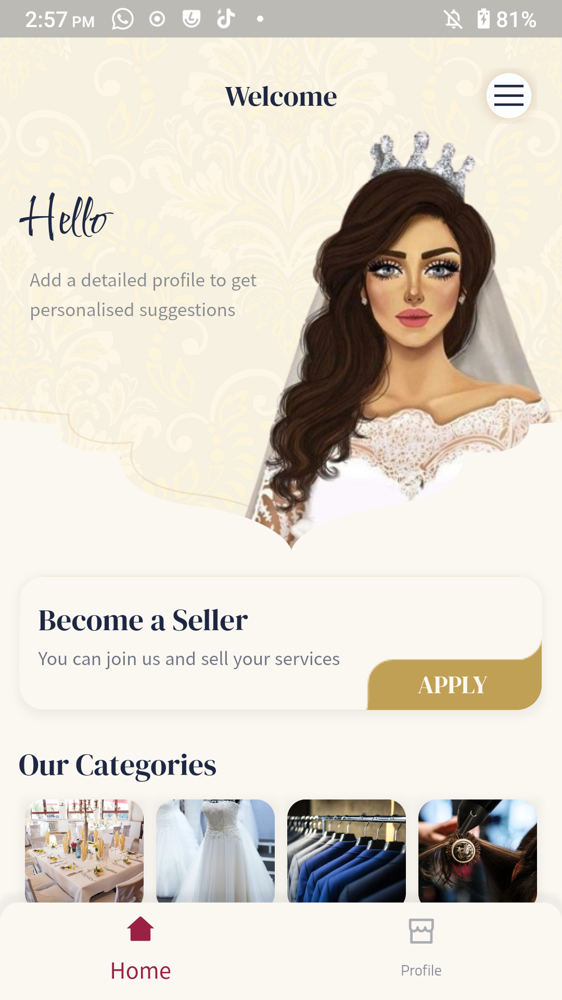
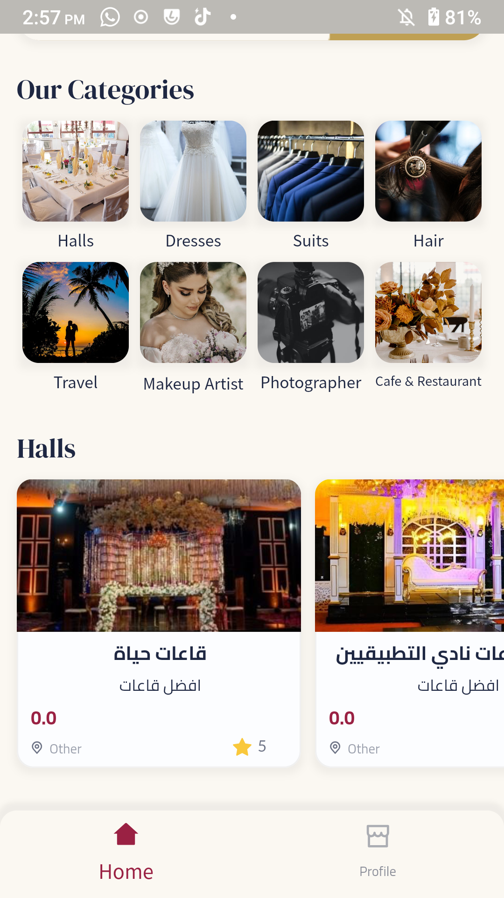
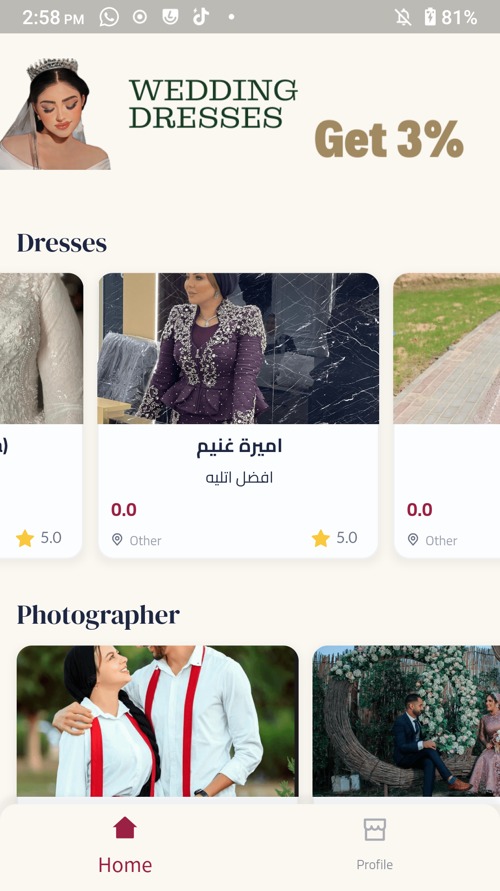
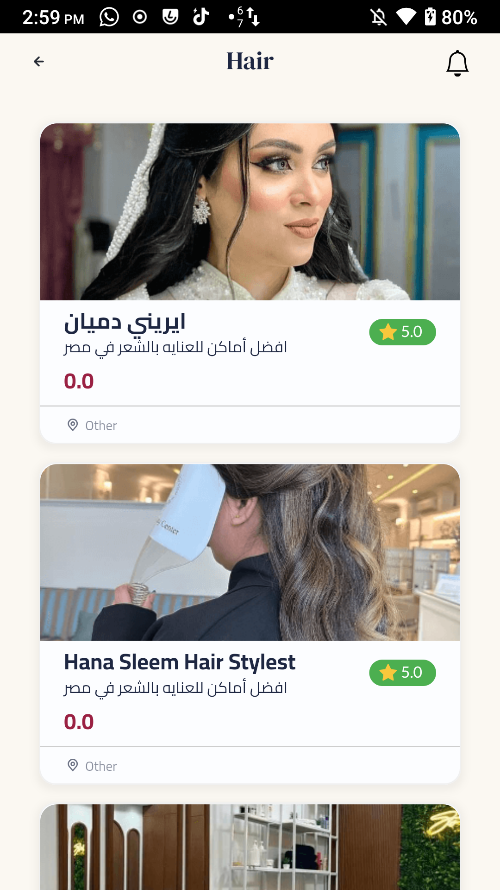
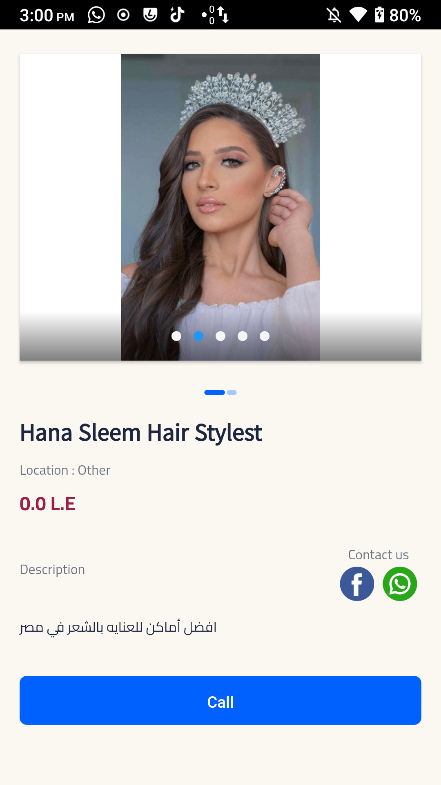

# Wahg Wedding App v1.0.4

This is Wahg Mobile App - It's a wedding app

## See Screenshots

<table>
  <tr>
    <td></td>
     <td></td>
     <td></td>
  </tr>
  <tr>
    <td></td>
    <td></td>
    <td></td>
  </tr>
   
  <tr>
    <td></td>
    <td></td>
  </tr>
  
 </table>
 

## This Projected Developed on:

I Started this project with:

• macOS: 12.6.8,

• Flutter version 3.16.4 on channel stable

• Dart version 3.2.3

• DevTools version 2.28.4

I Upgraded Flutter from 3.16.4 to Flutter 3.19.0

## Figma Project: 

https://tinyurl.com/2yjnheka

## This Projected Implement:

- Clean Architecture
- Localization with cubit and SharedPreferences
- FirebaseCrashlytics
- Dependency Injection using GetIt
- SharedPreferences
- Bloc/Cubit
- AppSettingsCache class
- MaterialApp keyed Route & onGenerateRoute 
- Theme Change
- Responsive Ui
- URL & calls Launcher

Auth:
- Login/register with email and password
- forget password
- Edit Profile Data
